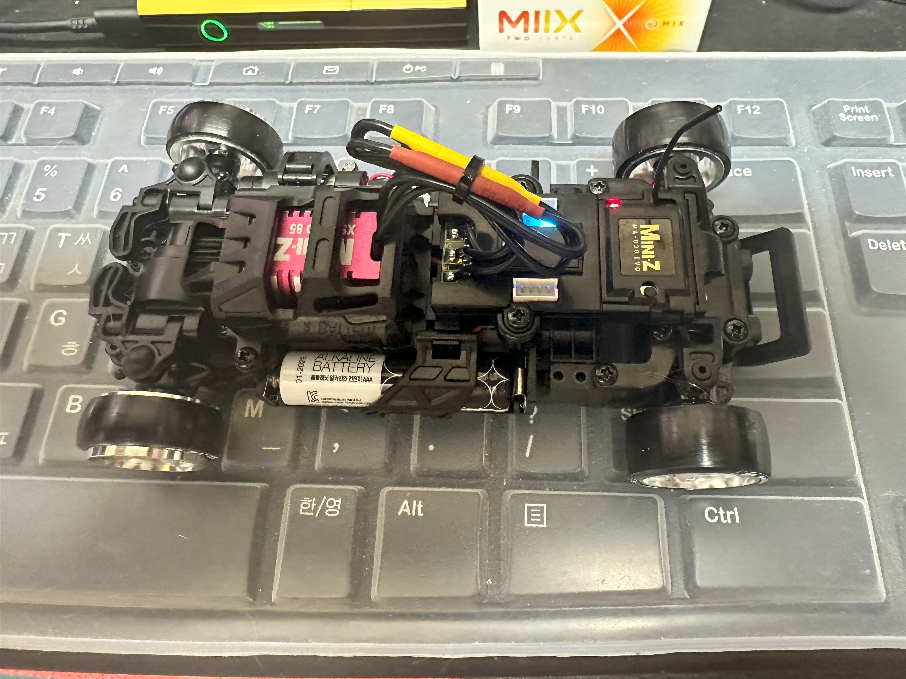

 Futaba 10PX를 장만하고, 집안에서 조용히 드리프트용으로 가지고 놀만한 Kyosho MA-030EVO2 Kit를 구매 하게 됐다.
 
 문제는 이 Kit은 수신기,타이어 등이 전부 누락된 순수하게 기본 차체 새시만 포함된 Kit이라는 것...
 
 수신기와 타이어+휠까지는 수월하게 구매하고, Binding까지는 성공 했지만..문제는 Body!!
 
 국내의 왠만한 RC온라인 Shop들은 MA-020용으로 나온 도장된 바디들이 전멸했다는 것!!! ㅠㅠ;
 
 하여 도장이 않된 바디 중 Toyota 86 바디를 구매 하게 됐고, 검색 중 와이드 바디킷이 존재한다는 사실을 발견!!! *ㅇ*, 홀린듯 구매 해버렸고, 처음에는 대충 그냥 사서 대충 조립하고, 대충 빨리 가지고 놀아야 겠다 라고 착각한 것이 이 글의 시작이다.

그림에서 보이다 시피 휠이랑 타이어랑 매칭도 않되있고...ㅎㅎ;

어쨋던 본론으로 넘어가서. 일단 MA-030EVO2 새시는 MA-020 새시와 Body가 호환된다는 정보를 입수 하고, 본격적으로 Body를 검색하는데, 호환되는 Body 종류가 많지가 않았다. 심지어 맘에 들지도 않았다...ㅠㅠ;

국내에서 확보 가능한 MA-020 Body는 아래와 같다.
